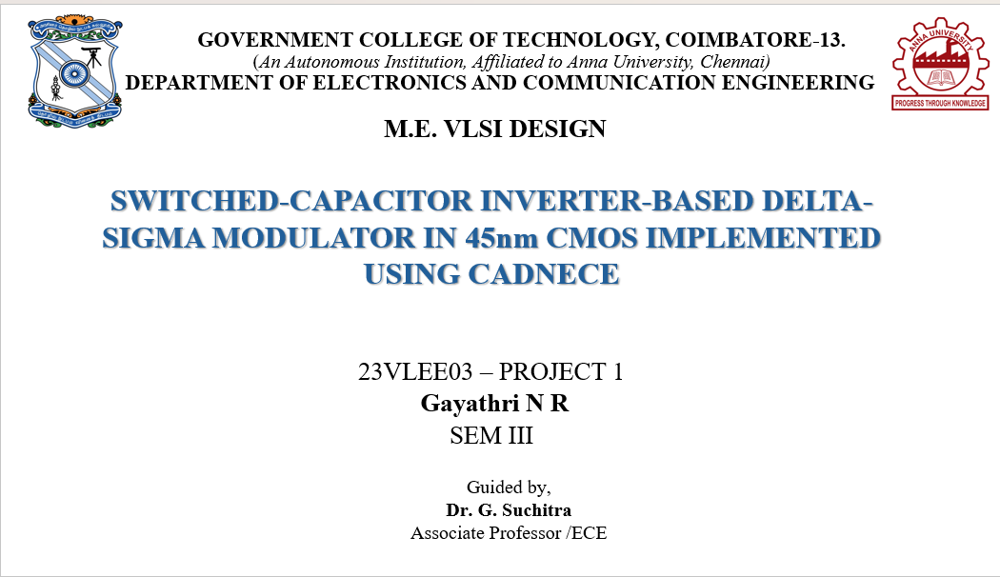
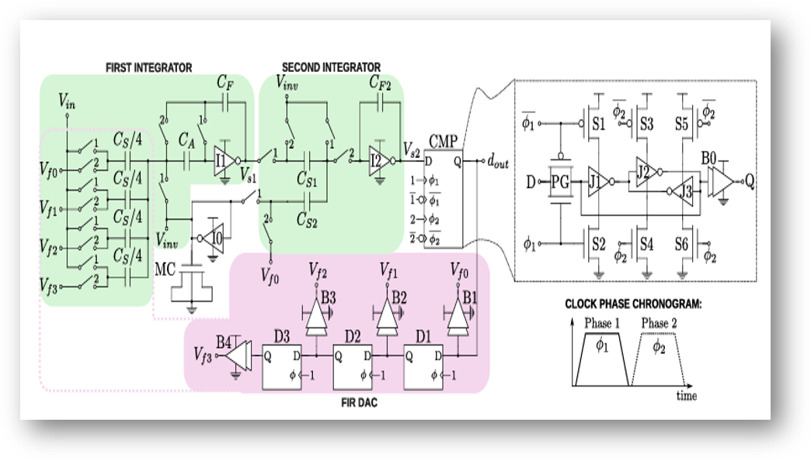
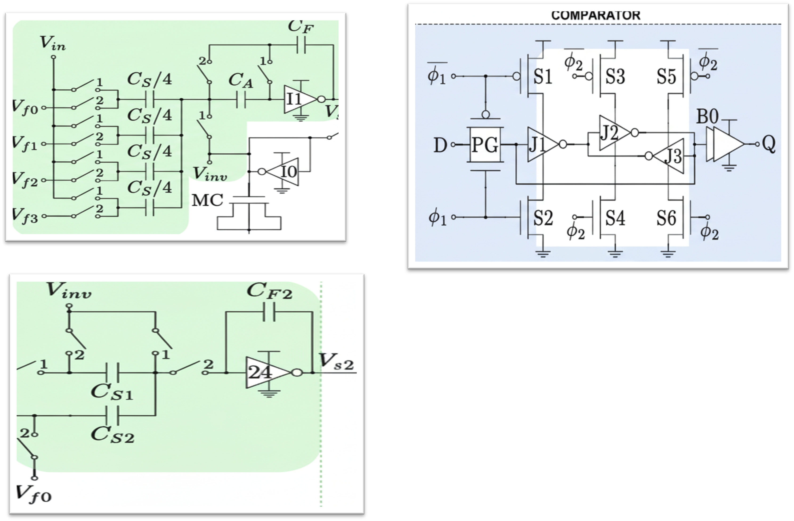
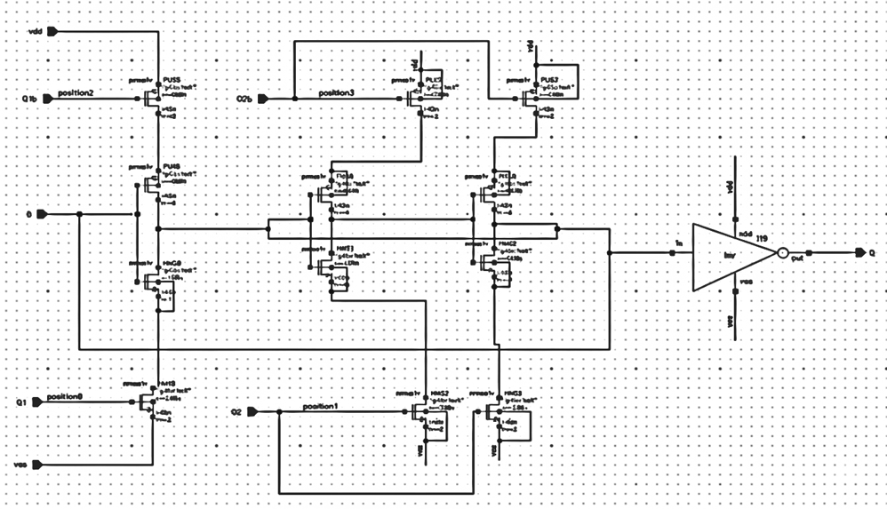
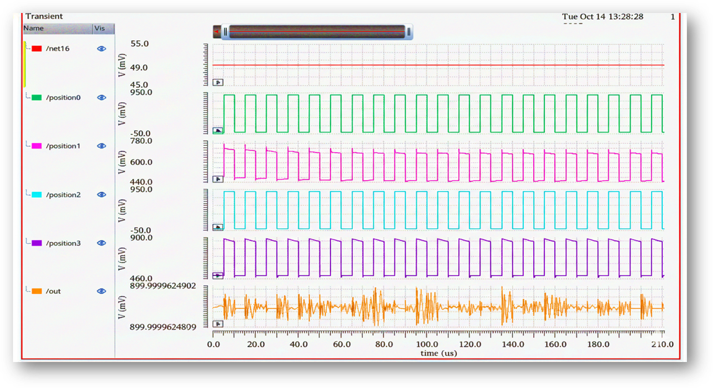
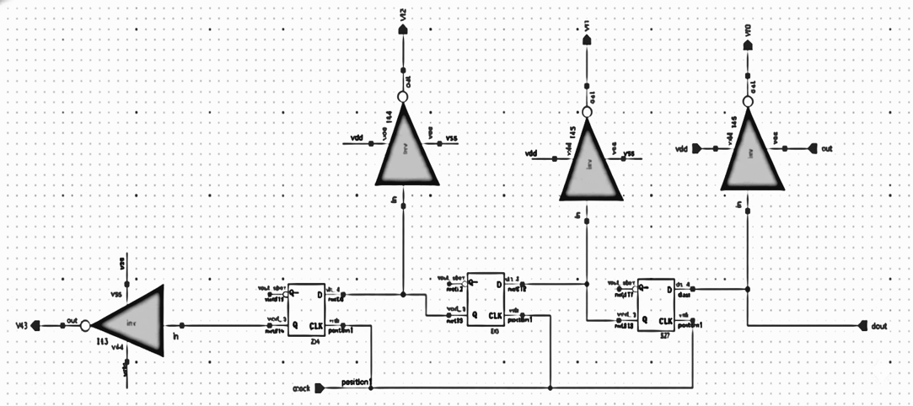
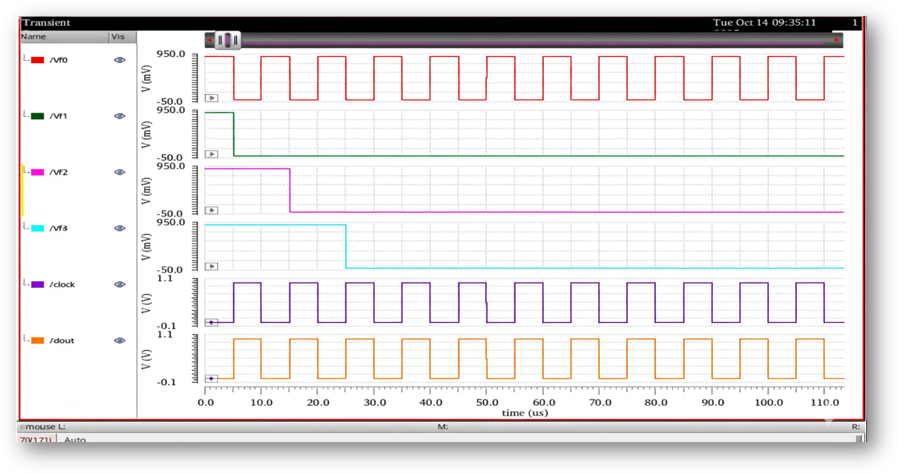
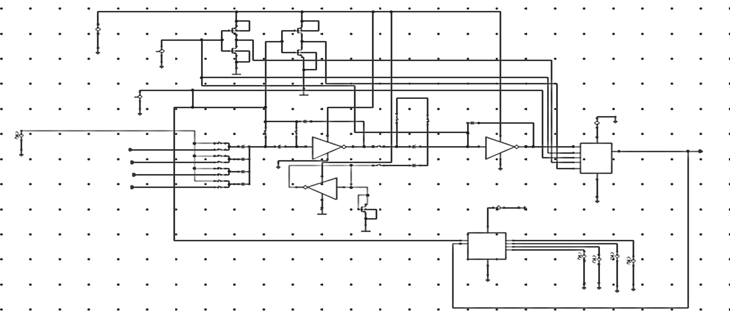
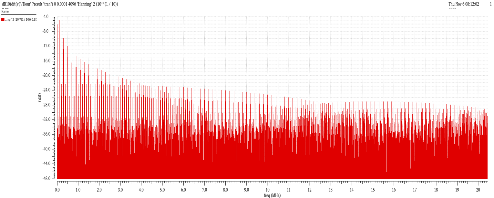
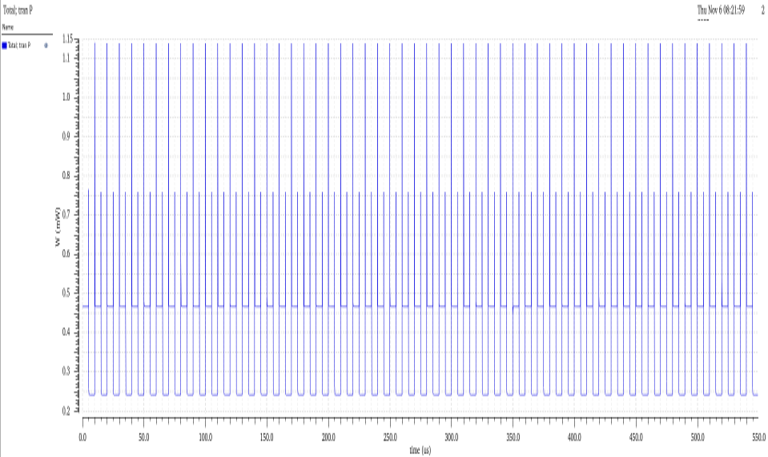

<div align="center">



# Switched-Capacitor Inverter-Based Delta-Sigma Modulator
## in 45nm CMOS | Ultra-Low Power | Wearable Applications

[]()
[]()
[]()
[]()
[]()

**71 nW power consumption · 2nd-order noise shaping · FIR DAC feedback · FFT validated · Wearable-ready**

*M.Tech VLSI Design Project | Government College of Technology, Coimbatore*

</div>

---

## ⚡ Performance at a Glance

<div align="center">

| Metric | Specification | Achieved | Status |
|:---|:---:|:---:|:---:|
| Technology Node | 45nm CMOS | **45nm gpdk** | ✅ |
| Modulator Order | 2nd Order | **2nd Order (2 integrators)** | ✅ |
| Power Consumption | Ultra-low | **71 nW** | ✅ |
| Architecture | Inverter-based SC | **SC Inverter + FIR DAC** | ✅ |
| Quantizer | 1-bit | **Regenerative Latch CMP** | ✅ |
| Noise Shaping | Verified | **FFT Spectrum Confirmed** | ✅ |
| Transient Response | Stable bitstream | **Rail-to-rail Dout** | ✅ |
| Input Bias (VDC) | Near inverter threshold | **450 mV** | ✅ |
| Input Amplitude (VAC) | VFS/3 | **300 mV** | ✅ |
| FFT Window | 4096 samples | **Hanning Window** | ✅ |

</div>

---

## 📌 Project Overview

This project designs, simulates, and validates an **Ultra-Low Power Switched-Capacitor Inverter-Based Second-Order Delta-Sigma (ΔΣ) Modulator** in **45nm CMOS** technology, targeting compact wearable and biomedical applications.

Traditional op-amp-based integrators are replaced with **inverter-based switched-capacitor integrators** — significantly reducing power consumption while maintaining high resolution. The design achieves **71 nW** total power consumption, verified through transient analysis and FFT spectral evaluation in **Cadence Virtuoso**.

> 🎯 **Key Innovation:** Inverter-based integrators replace conventional OTA amplifiers, enabling operation at ultra-low supply voltages with minimal silicon area — critical for energy-harvested wearable devices.

---

## 🏗️ System Architecture

<div align="center">

<br><i>Figure 1: Second-order switched-capacitor inverter-based delta-sigma modulator block diagram</i>
</div>

<br>

The modulator consists of four tightly coupled subsystems:

| Block | Function |
|:---|:---|
| **SC Inverter Integrator 1** | Samples analog input (Vin); accumulates charge difference between input and feedback |
| **SC Inverter Integrator 2** | Second-order integration; provides aggressive noise shaping |
| **Comparator (CMP)** | Regenerative latch; quantizes integrator output to 1-bit digital stream (Dout) |
| **FIR DAC** | 3-tap FIR feedback using D flip-flops + weighted capacitors; shapes quantization noise |

### Signal Flow

```
Analog Input (Vin)
        │
        ▼
┌───────────────┐    ┌───────────────┐    ┌──────────────┐
│ SC Inverter   │───►│ SC Inverter   │───►│  Comparator  │───► Dout (1-bit)
│ Integrator 1  │    │ Integrator 2  │    │  (CMP Latch) │         │
└───────────────┘    └───────────────┘    └──────────────┘         │
        ▲                                                           │
        │                 ┌─────────────────────────────────────────┘
        │                 ▼
        └──────── FIR DAC (3-tap: Vf0, Vf1, Vf2, Vf3)
                  (Weighted feedback via D flip-flop chain)
```

---

## ⚙️ Module Design

### Module 1 — Switched-Capacitor Inverter Integrators

<div align="center">

<br><i>Figure 2: Switched-capacitor inverter-based integrator — Integrator 1 (left) and Integrator 2 (right)</i>
</div>

<br>

Two non-overlapping clock phases control the switching sequence:

| Clock Phase | Role | Action |
|:---|:---:|:---|
| **ϕ1 (Sampling)** | Phase 1 | Input switches ON → Vin sampled onto CS array; CMP latch reset |
| **ϕ1̄ (Complement)** | Phase 1 complement | Controls PMOS switches during sampling |
| **ϕ2 (Integration)** | Phase 2 | Charge transferred to CF; CMP latch enabled for evaluation |
| **ϕ2̄ (Complement)** | Phase 2 complement | Controls PMOS switches during integration |

**Why inverter-based?**
- Replaces power-hungry OTA amplifiers
- Operates at low supply voltages (sub-1V capable)
- Smaller silicon area — suited for large-scale integration
- Improved linearity via precise charge transfer

---

### Module 2 — Comparator (Regenerative Latch)

<div align="center">

<br><i>Figure 3: Regenerative latch comparator schematic (Cadence Virtuoso, 45nm)</i>
</div>

<br>

<div align="center">

<br><i>Figure 4: Comparator transient response — clean rail-to-rail digital switching, no metastability</i>
</div>

<br>

| Performance Indicator | Observation |
|:---|:---|
| **Digital Snap** | Output switches cleanly between supply rails during evaluation phase |
| **No Metastability** | High-frequency noise eliminated — clear decision every clock cycle |
| **Rail-to-Rail** | Suitable to drive downstream FIR DAC logic directly |

---

### Module 3 — FIR DAC (3-Tap Feedback)

<div align="center">

<br><i>Figure 5: FIR DAC schematic — D flip-flop chain with weighted capacitor taps</i>
</div>

<br>

<div align="center">

<br><i>Figure 6: FIR DAC transient — 4 delayed feedback taps (Vf0–Vf3) verified with exact 1-cycle delays</i>
</div>

<br>

| Tap | Signal | Delay | Verification |
|:---|:---:|:---:|:---|
| Vf0 (Red) | Zero delay | z⁻⁰ | Instantaneous — follows Dout directly ✅ |
| Vf1 (Green) | 1 cycle | z⁻¹ | Delayed by exactly 1 clock period ✅ |
| Vf2 (Magenta) | 2 cycles | z⁻² | Delayed by 2 clock periods ✅ |
| Vf3 (Cyan) | 3 cycles | z⁻³ | Full 3-tap delay line confirmed ✅ |

---

## 📊 Full Modulator — Simulation Results

### Transient Response

<div align="center">

<br><i>Figure 7: Complete modulator transient — Vin, Integrator 1 & 2 outputs, Comparator node, Dout bitstream</i>
</div>

<br>

| Signal | Color | Voltage Range | Observation |
|:---|:---:|:---:|:---|
| **Vin** | Red | ≈ 448 mV | Constant DC — steady-state bitstream test |
| **I1 (net023)** | Violet | 0.83V – 0.94V | Ramp waveform — correct charge accumulation ✅ |
| **I2 (net024)** | Pink | −0.8V to +1.1V | Pulsed — 2nd-order integration confirmed ✅ |
| **CMP (net030)** | Cyan | −0.8V / +1.6V | Clean comparator switching ✅ |
| **Dout** | Green | −0.95V / +0.95V | Symmetric 1-bit bitstream; pulse density ∝ Vin ✅ |

---

### FFT Spectrum Analysis

<div align="center">

<br><i>Figure 8: FFT spectrum (4096 samples, Hanning window) — signal peak at fin, noise shaped to high frequencies</i>
</div>

<br>

| FFT Parameter | Value | Inference |
|:---|:---:|:---|
| Input Type | Sine wave (AC + DC offset) | Enables statistical performance measurement |
| VDC Bias | 450 mV | Centered near inverter threshold for proper switching |
| VAC Amplitude | 300 mV (VFS/3) | Sets input power for peak performance evaluation |
| fin (Frequency) | 2.335 Hz | Low-frequency tone — tests resolution and noise |
| FFT Window | 4096 samples (Hanning) | Smooth spectral leakage, accurate noise floor |

**Key FFT Observations:**
- Signal peak clearly visible at input frequency → accurate signal representation ✅
- Low in-band noise floor → effective quantization noise suppression ✅
- Noise energy pushed to higher frequencies → 2nd-order noise shaping confirmed ✅

---

### Power Analysis

<div align="center">

<br><i>Figure 9: Cadence power analysis — total modulator power consumption: 71 nW</i>
</div>

<br>

| Power Metric | Value |
|:---|:---:|
| **Total Power Consumption** | **71 nW** |
| Power Category | Ultra-Low Power (ULP) |
| Target Application | Wearable / Biomedical devices |
| Supply Voltage | Sub-1V (45nm CMOS) |

> ⚡ **71 nW** is nanowatt-level operation — enabling months of battery life in energy-harvested wearable sensors.

---

## 🆚 Proposed Design vs Reference Paper

| Parameter | Reference (UMC 180nm) | **This Design (45nm)** |
|:---|:---:|:---:|
| Technology | 180nm CMOS | **45nm CMOS** |
| Architecture | SC Inverter-based ΔΣ | **SC Inverter-based ΔΣ** |
| Order | 2nd Order | **2nd Order** |
| Feedback | FIR DAC | **3-tap FIR DAC** |
| Power | ~71.5 nW | **71 nW** |
| Quantizer | 1-bit comparator | **Regenerative latch CMP** |
| Validation | Chip fabricated | **Cadence Virtuoso simulation** |
| Target | Wearable | **Wearable / Biomedical** |

---

## 🛠️ Tools & Technology Stack

| Category | Tool / Technology |
|:---|:---|
| Design & Simulation | Cadence Virtuoso |
| Technology Node | 45nm gpdk (generic PDK) |
| Analysis | Transient Analysis, FFT Spectrum Analysis, Power Analysis |
| Clock Strategy | Two-phase non-overlapping clocks (ϕ1, ϕ2 + complements) |
| Quantizer | Regenerative latch comparator |
| Feedback | 3-tap FIR DAC (D flip-flop chain + weighted capacitors) |
| Target Application | Wearable devices, Biomedical sensors |

---

## 📁 Repository Structure

```
delta-sigma-adc-45nm/
│
├── schematic/
│   ├── integrator1.cdl          # SC Inverter Integrator 1 netlist
│   ├── integrator2.cdl          # SC Inverter Integrator 2 netlist
│   ├── comparator.cdl           # Regenerative latch comparator
│   ├── firdac.cdl               # FIR DAC with DFF chain
│   └── top_modulator.cdl        # Full modulator top-level
│
├── matlab/
│   └── fft_analysis.m           # FFT spectrum post-processing script
│
├── images/
│   ├── banner.png
│   ├── block_diagram.png
│   ├── integrator_schematic.png
│   ├── comparator_schematic.png
│   ├── comparator_transient.png
│   ├── firdac_schematic.png
│   ├── firdac_transient.png
│   ├── full_transient.png
│   ├── fft_spectrum.png
│   └── power_analysis.png
│
└── README.md
```

---

## 🔮 Future Scope

| Enhancement | Description |
|:---|:---|
| **Silicon Validation** | Tape-out in UMC 180nm or TSMC 65nm for physical chip measurement |
| **Higher Order** | Extend to 3rd-order modulator for improved SNDR and dynamic range |
| **Continuous-Time** | Implement CT-ΔΣ variant to eliminate anti-aliasing filter requirement |
| **Chip Integration** | Integrate with a RISC-V SoC as a precision sensor front-end ADC |

---

## 📚 References

1. Y. Chae and G. Han, *"Low-voltage, low-power, inverter-based switched-capacitor ΔΣ modulator,"* IEEE JSSC, vol. 44, no. 2, Feb. 2009.
2. U. Christen et al., *"A 140-µW 88-dB DR inverter-based ΔΣ modulator for MEMS microphones,"* IEEE ISSCC, Feb. 2013.
3. X. Liu et al., *"An incremental inverter-based ΔΣ ADC for sensor applications,"* IEEE TCAS-I, vol. 59, no. 8, Aug. 2012.
4. B. Chi et al., *"A 500-nW continuous-time inverter-based ΔΣ modulator for biomedical applications,"* IEEE TBioCAS, vol. 8, no. 6, Dec. 2014.
5. X. Zhao et al., *"A 0.9-V 89-dB SNDR 4-µW inverter-based ΔΣ modulator using floating inverter amplifiers,"* IEEE JSSC, vol. 57, no. 3, Mar. 2022.
6. R. Hao et al., *"A 92-dB SNDR 8-µW inverter-based ΔΣ modulator with SMASH loop filter,"* IEEE JSSC, vol. 59, no. 1, Jan. 2024.
7. A. Catania et al., *"Ultralow-power inverter-based ΔΣ modulator for wearable applications,"* IEEE Access, June 2024.

---

## 👩‍💻 Author

<div align="center">

**N R Gayathri**
M.Tech VLSI Design · Government College of Technology, Coimbatore

[](mailto:nrgayu2002@gmail.com)
[](https://linkedin.com/in/n-r-gayathri)

*Guided by Dr. G. Suchitra, Associate Professor, ECE Dept., GCT Coimbatore*

</div>

---

<div align="center">
<sub>⭐ If this project helped you, consider starring the repository!</sub>
</div>
